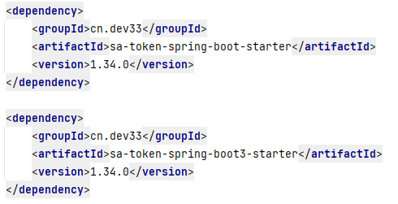
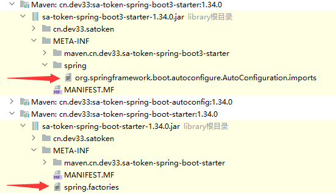

## springboot2 实现的SPI机制方法说明, 具体细节请下载项目后查看源代码
1. 新建项目
2. 新建文件: /src/main/resources/META-INF/spring.factories
3. 在spring.factories按如下格式写入内容
```
// 格式:
org.springframework.boot.autoconfigure.EnableAutoConfiguration=需要自动配置的类全路径
// 示例:
org.springframework.boot.autoconfigure.EnableAutoConfiguration=com.demo.config.Config
```
4. 一旦写入完成, 对应的类就自动拥有@Configration注解的功能
5. 配置有两种方式, 两种方式在此说明项目中均有代码实例
   1. 单类配置, 所有信息都写入一个Bean中进行配置
   2. 扫描配置, 指定一个待扫描的位置, 适合多Bean自动搜索
   

## springboot3 更新后的自动配置介绍
一般来说在网上搜索springboot3新特性, 大部分博客在内容中都会提到一句

> SpringBoot2.7引入了新的自动装配方式
> 
> 3.0 新版本之后，老的写法 spring.factories 就没了

新的写法从 spring.factories 文件管理修改为 spring 目录下各种包名的文件导入. 这么说可能不太好理解, 我们可以在demo项目中同时引入SaToken的Springboot Stater和Springboot3 Stater, 但不需要启动项目



这时候通过 IDE 比如 idea 查看项目的外部库文件, 就可以看到如下内容:



此时, META-INA/spring/org.springframework.boot.autoconfigure.AutoConfiguration.imports 文件里面就可以一行行写入要自动配置的类的包路径加类名, 比如:

```
com.mycorp.libx.autoconfigure.LibXAutoConfiguration
com.mycorp.libx.autoconfigure.LibXWebAutoConfiguration
```


这里只是做简单的介绍, 了解原理即可. 更多详细的用法可以看一下对应的官方文档:

[springboot3 自动配置官方文档](https://docs.spring.io/spring-boot/docs/current/reference/html/features.html#features.developing-auto-configuration)
