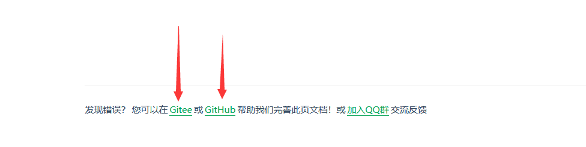
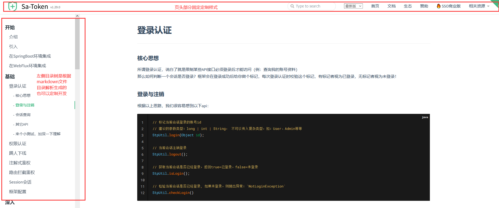
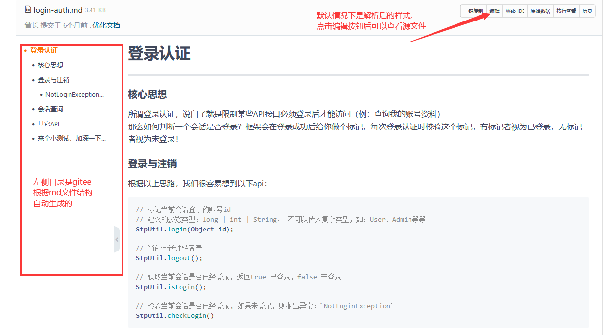
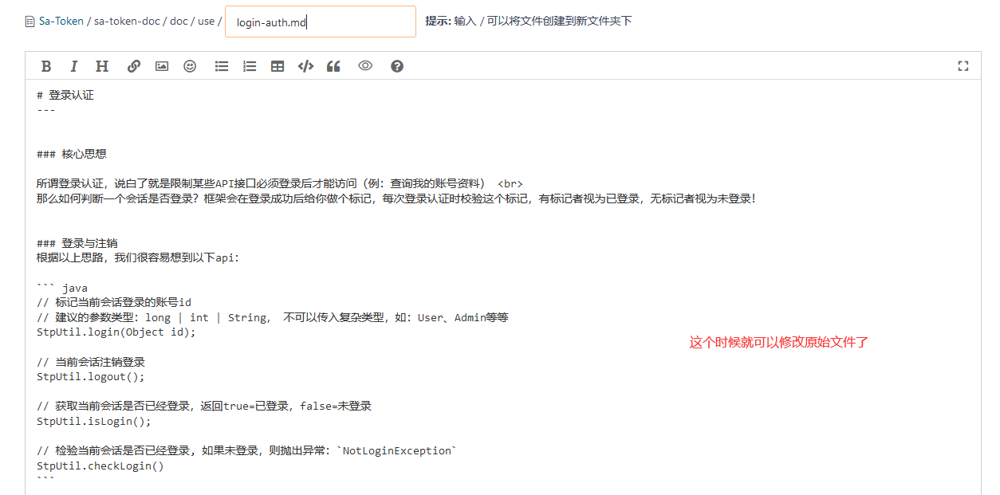
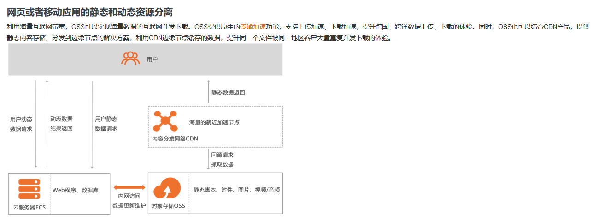
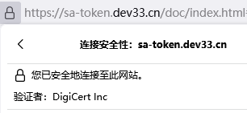

# SaToken 静态网站的搭建解析
## 页面搭建
进入 `SaToken` 官网的时候, 用来展示教程页面的技术就是 `docsify`

使用 `docsify` 技术可以很方便的搭建一个静态页面, 通过书写 `Markdown` 文档就可以在访问时自动解析成对应的页面, 非常nice. 有需要的朋友可以去官网看看(所有链接均附文末)

事实上, 当我们在 SaToken 官网的某个页面底部点击 Gitee 或 GitHub 的时候,

看到的文件就是当前页面所对应 `docsify` 解析的 `Markdown` 文档.

就比如: https://sa-token.dev33.cn/doc/index.html#/use/login-auth

和对应源代码页面: https://gitee.com/dromara/sa-token/blob/dev/sa-token-doc/doc/use/login-auth.md

群主为了界面美化还做了很多细节方面的工作, 这一部分涉及前端深入方面的内容, 不过多讨论. 

## 资源存储
除了界面, 文字排版, 此外还有一个也是静态网站的重点内容, 那就是资源. 无论是图片还是视频资源, 都相比于文字或者脚本文件的加载要慢, 如果放到同一个服务器上, 可能会拖慢页面整体加载的速度, 这时候就要用到文件对象存储服务(OSS: Object Storage Service)了, SaToken 官网的图片也是使用这种方式加载出来的.同步加载的好处是速度快, 用户体验更好.

## 网络安全
当我们使用 http 访问页面也是可以的, 但不安全, 为此可以使用 https 即 SSL 证书加密通信. SaToken 也安装了相应的证书保证了链接的安全.

## 附链接
[docsify 官网](https://docsify.js.org/#/zh-cn/quickstart)

[Markdown 语法介绍](https://blog.csdn.net/m0_49381207/article/details/119260027)

[阿里云OSS ](https://www.aliyun.com/product/oss) 需要付费

OSS 有免费搭建方式, 比如 [MinIO](http://www.minio.org.cn/) 等

[DigiCert](https://www.digicertchina.com/pro-ssl-certificate/) 需要付费

ssl加密证书也有免费方式, 比如 [Let's Encrypt](https://letsencrypt.osfipin.com/) 等

> 请大家按需使用